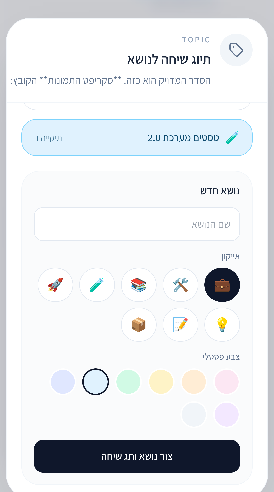
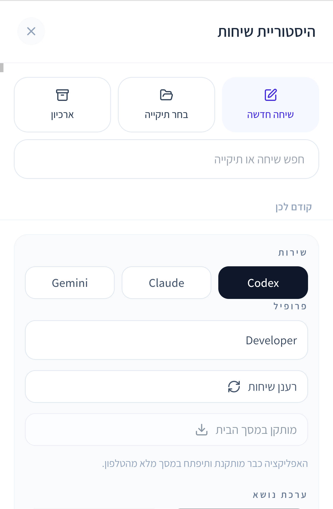
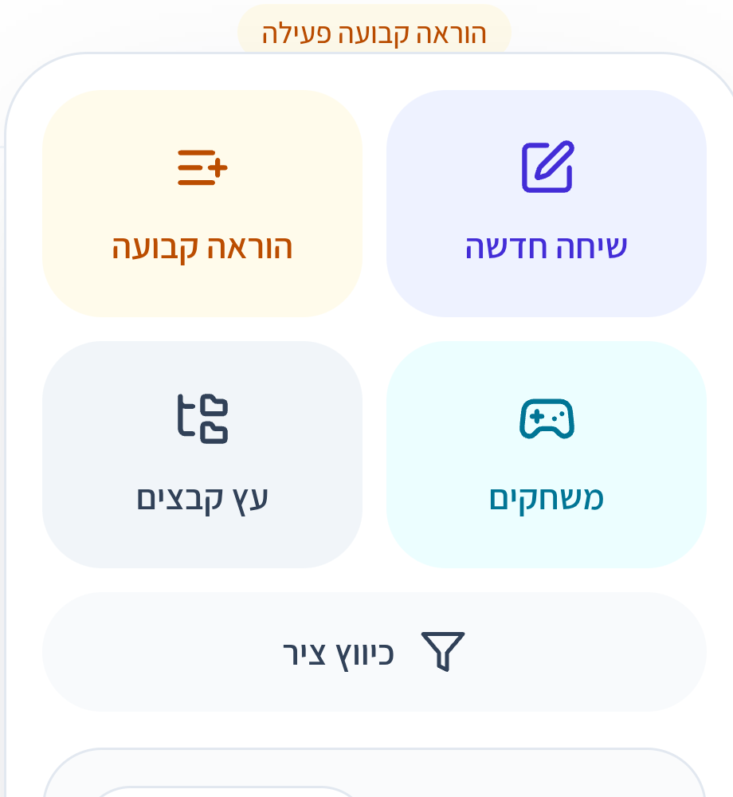
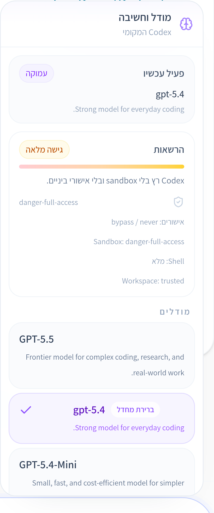

# code-ai

`code-ai` היא סביבת עבודה מוביילית להפעלה ולתיאום של סוכני הקוד הטרמינליים המובילים מתוך ממשק אחד:

- Codex
- Claude Code
- Gemini CLI

המטרה שלה היא לתת שכבת שליטה אחת, נקייה ונוחה, מעל פרופילי CLI אמיתיים, עם תורים, תזמון, נושאים, זיכרון פרויקט, העברות בין ספקים, העתקות בין משתמשים, מצב תמיכה, וזרימות עבודה חוזרות.

## תצוגה מהמערכת

<p align="center">
  
  
  
  
</p>

## למה זה שונה

- ממשק אחד לשלושה ספקים, עם homes אמיתיים לכל provider.
- חוויית מובייל אמיתית, לא עטיפה שולחנית כבדה.
- Queue, תזמון, recurring runs, ו־wake-up triggers כחלק מהמוצר.
- עוגנים, סקילים, תזכורות, נושאים, פרויקטים ומשימות ברמת השיחה.
- העברות בין ספקים והעתקת שיחות בין משתמשים.
- מצב תמיכה פנימי עם אחסון מבודד וכללי sandbox.
- זיהוי context, הרשאות, מודל, מהירות תגובה, קבצים ששונו, וכלי ריצה.

## מה עושים כאן בפועל

ב־`code-ai` אפשר:

- לפתוח שיחות רגילות
- למזלג או להעביר שיחות
- לצרף קבצים, עוגנים, סקילים, תזכורות ומצבים
- לתזמן הרצות חד־פעמיות או קבועות
- לנהל תתי־משימות ופרויקטים
- לראות שינויים בקבצים, traces של כלים, מצב queue, חלון context, rate limits והרשאות

האפליקציה לא “מחקה” ספקים דרך API חיצוני בלבד; היא יושבת מעל התקנות ה־CLI האמיתיות שעל השרת.

## ספקים נתמכים

אפשר לעבוד עם ספק אחד בלבד או עם כל השלושה.

דרישות בסיס:

- Node.js 20 ומעלה
- npm
- Git

CLIים אופציונליים:

- Codex CLI
- Claude CLI
- Gemini CLI

החוויה המלאה מתקבלת כאשר שלושת ה־CLI מותקנים ומחוברים על השרת.

## התחלה מהירה

### Linux / macOS

```bash
git clone https://github.com/binacshera-ui/code-ai.git
cd code-ai
./install.sh \
  --app-name code-ai \
  --port 4000 \
  --profiles-json '[{"id":"codex-main","label":"Codex","provider":"codex","codexHome":"/home/ubuntu/.codex","workspaceCwd":"/srv/workspace","defaultProfile":true},{"id":"claude-main","label":"Claude","provider":"claude","codexHome":"/home/ubuntu/.claude","workspaceCwd":"/srv/workspace"},{"id":"gemini-main","label":"Gemini","provider":"gemini","codexHome":"/home/ubuntu/.gemini","workspaceCwd":"/srv/workspace"}]' \
  --device-password change-me-now \
  --session-secret change-me-too
```

### Windows PowerShell

```powershell
git clone https://github.com/binacshera-ui/code-ai.git
cd code-ai
powershell -ExecutionPolicy Bypass -File .\install.ps1 `
  --app-name code-ai `
  --port 4000 `
  --profiles-json '[{"id":"codex-main","label":"Codex","provider":"codex","codexHome":"C:\\Users\\Administrator\\.codex","workspaceCwd":"D:\\workspace","defaultProfile":true},{"id":"claude-main","label":"Claude","provider":"claude","codexHome":"C:\\Users\\Administrator\\.claude","workspaceCwd":"D:\\workspace"},{"id":"gemini-main","label":"Gemini","provider":"gemini","codexHome":"C:\\Users\\Administrator\\.gemini","workspaceCwd":"D:\\workspace"}]' `
  --device-password change-me-now `
  --session-secret change-me-too
```

## מבנה הריפו

- `client/` — ממשק המשתמש
- `server/` — ניתוב ספקים, queue, parsing ואורקסטרציה
- `deploy/code-ai/` — מתקין, exporter ונכסי deployment
- `scripts/` — כלי עזר מקומיים
- `ecosystem.config.cjs` — תהליך PM2

## שני מושגים שחייבים להבין

### `workspaceCwd`

תיקיית העבודה הדיפולטיבית לשיחות חדשות.

### `codexHome`

שם legacy ל־provider home של הפרופיל הנבחר.

לדוגמה:

- Codex -> `.codex`
- Claude -> `.claude`
- Gemini -> `.gemini`

השם נשאר `codexHome` כדי לא לשבור התקנות קיימות, JSON ישן, ו־metadata שכבר נשמר.

## מה לקרוא אחר כך

- `README.md` — גרסה באנגלית
- `AGENT.he.md` — הנחיות תפעול והעברה לסוכן/מפעיל אחר
- `WINDOWS.FIELD-NOTES.he.md` — הערות שטח ל־Windows
- `deploy/code-ai/install.mjs` — המתקין הראשי
- `server/config.ts` — מבנה profiles ואחסון
- `client/src/components/codex/CodexMobileApp.tsx` — מעטפת ה־UI הראשית

## הערה על פריסה

הריפו מגיע עם מתקין שמבצע אוטומטית:

- כתיבת `.env`
- כתיבת `CODEX_PROFILES_JSON`
- יצירת storage
- התקנת תלויות
- build מלא ללקוח ולשרת
- העלאה או רענון של PM2

אם אתה מחפש את שכבת התפעול המלאה, עבור אל:

- `deploy/code-ai/install.mjs`
- `ecosystem.config.cjs`
- `AGENT.he.md`
