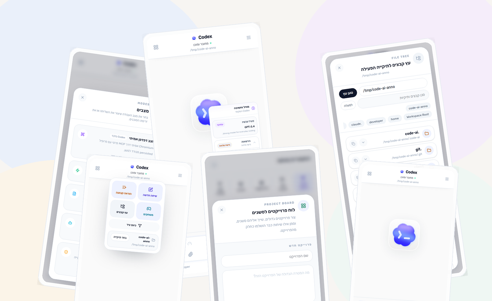
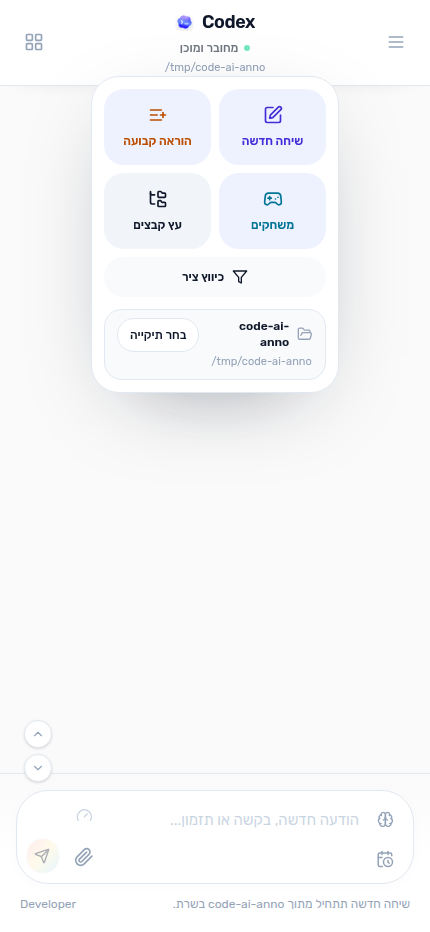
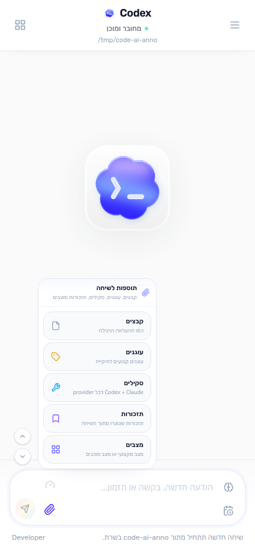
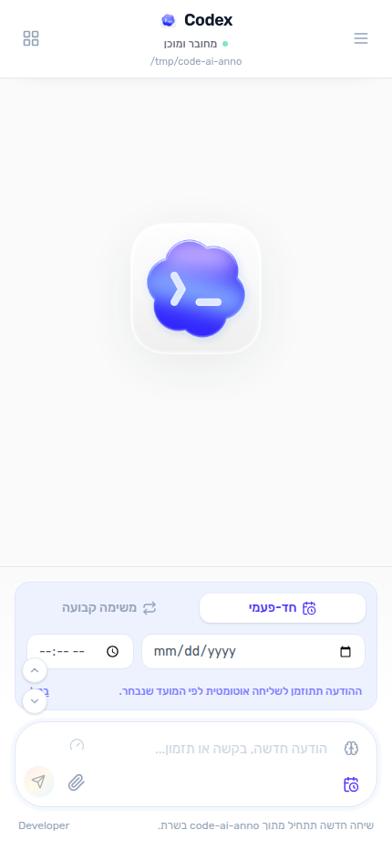
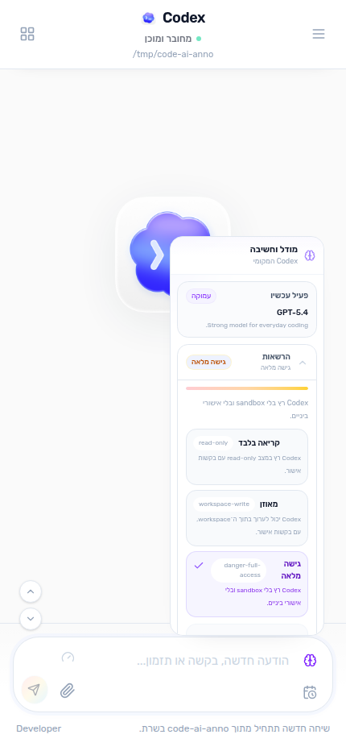
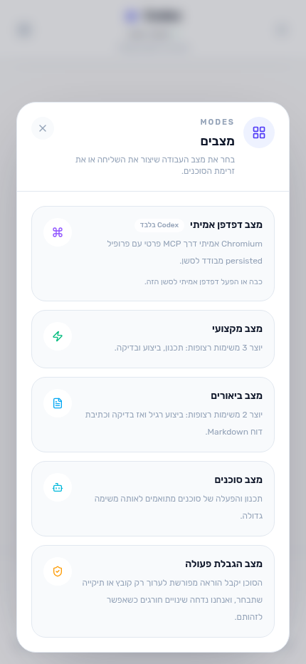
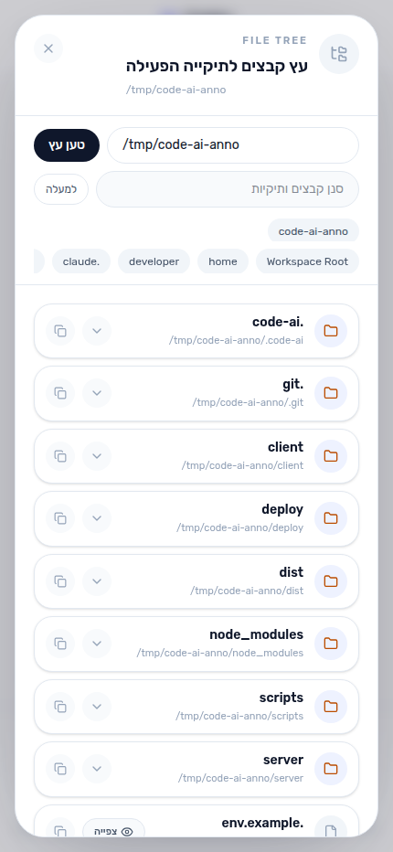
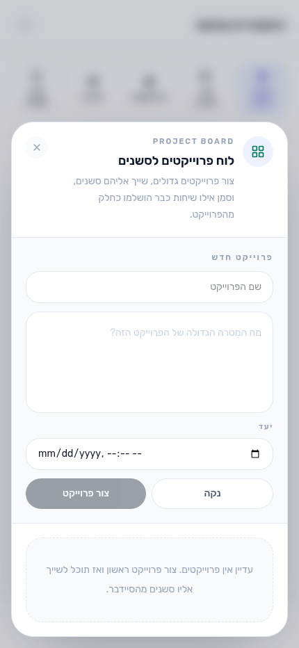

# code-ai

**עמדת שליטה מוביילית לסוכני טרמינל אמיתיים.**

`code-ai` מאחדת את **Codex**, **Claude Code** ו־**Gemini CLI** לתוך סביבת עבודה אחת, נקייה ומוביילית, שנבנתה לביצוע אמיתי ולא לדמו צעצוע. היא יושבת מעל ה־CLI המקומיים האמיתיים שלך, שומרת על ה־homes האמיתיים שלהם, ומוסיפה את שכבת ההפעלה שחסרה כמעט בכל כלי אחר: תורים, תזמון, פרויקטים, הקשר חוזר, מצבי עבודה, דפדפן אמיתי, ושחזורי סשנים.

<p align="center">
  
</p>

<p align="center"><em>כל התמונות בהמשך הן צילומי מובייל חיים מתוך המערכת עצמה.</em></p>

## איך זה מרגיש בפועל

- **ממשק אחד לשלושה ספקים** עם homes אמיתיים ושליטה ייעודית לכל provider.
- **חוויית שיחה מוביילית אמיתית** במקום עטיפת shell שולחנית ומסורבלת.
- **תורים, הרצות חוזרות ומצבי follow-up** לעבודה ארוכה ומסודרת.
- **הקשר חוזר** עם קבצים, עוגנים, סקילים, תזכורות והגבלות פעולה.
- **מצב דפדפן אמיתי ל־Codex** עם Chromium חי ופרופיל persisted.
- **מצב עיצוב Codex × Gemini** עם קנבס משתמש והחלטה מפורשת של Codex בכל ייעוץ אם להשמיט את התמונה, לשלוח אותה במלואה או לשלוח חיתוך ממוקד.
- **מצב חוויית משתמש Codex × Gemini** עם נקודת פתיחה עצמאית ועיוורת, עמדה פרטית של Codex ועד עשרה סבבי טיעון־נגד לפני זיקוק מוצרי לפי שלבי הלקוח.
- **פרויקטים, נושאים, ארכיון והעתקות בין משתמשים** כדי לנהל עבודה גדולה בלי ללכת לאיבוד.

## סיור מוצר

### נקודות כניסה מהירות

<p align="center">
  
  
  
</p>

- **פעולות מהירות** שומרות את הזרימות העיקריות במרחק לחיצה אחת: שיחה חדשה, הוראה קבועה, עץ קבצים, כלי בדיקה ומשחקים.
- **צירופים** הם הרבה מעבר להעלאת קובץ: אפשר להוסיף קבצים, עוגנים, סקילים, תזכורות ומצבים מתוך נקודת כניסה אחת.
- **תזמון** מאפשר גם הרצה חד־פעמית וגם הרצות מחזוריות בלי לצאת ממסך השיחה.

### שליטה אמיתית על הריצה

<p align="center">
  
  
</p>

- **פאנל המודל והחשיבה** מציג את מצב הריצה האמיתי: מודל, עומק חשיבה, הרשאות, sandbox, מהירות תגובה והתנהגות provider.
- **מצבי עבודה** הופכים את אותה שיחה לאחד מהבאים:
  - ריצה רגילה,
  - מצב מקצועי עם תכנון/ביצוע/בדיקה,
  - מצב ביאורים עם דוח follow-up,
  - מצב סשן סוכנים,
  - מצב דפדפן אמיתי,
  - מצב עיצוב סשן־סקופי עם קנבס ויועץ Gemini מבודד,
  - מצב חוויית משתמש שמאתגר הנחות דרך מסע לקוח, אמון, פסיכולוגיה, כלכלה התנהגותית, חיכוך והיררכיה חזותית,
  - או מצב הגבלת פעולה לקובץ/תיקייה מסוימים.

### נראות מלאה של סביבת העבודה

<p align="center">
  
  
</p>

- **עץ הקבצים** נותן תצוגה חיה של תיקיית העבודה והופך בחירת נתיבים לדבר מעשי גם במובייל.
- **לוח הפרויקטים** מאפשר לקבץ שיחות ליוזמות גדולות, לעקוב אחרי משימות משנה, ולא לתת לעבודה מרובת־סשנים להתפזר.

## מה אפשר לעשות כאן באמת

### להריץ ספקים אמיתיים

- לפתוח שיחת Codex, Claude או Gemini מאותו UI.
- לשמור homes ותיקיות עבודה שונות לכל profile.
- לראות מה המודל באמת שלח לכלים ומה הכלים באמת החזירו.
- להמשיך, למזלג, להעביר, לארכב, להעתיק ולשחזר סשנים בלי לאבד את ההקשר התפעולי.

### לעבוד עם הקשר חוזר במקום לחזור על עצמך

- לצרף קבצים רגילים מהמכשיר או מה־workspace.
- להוסיף **עוגנים** שמצביעים לקבצים או תיקיות חשובים.
- לצרף **סקילים** כהקשר תפעולי חוזר.
- לשמור **תזכורות** מכל הודעה ולהזריק אותן שוב בהמשך.
- להפעיל **מצב הגבלת פעולה** כדי להנחות את המודל לערוך רק קובץ או תיקייה מסוימים, ובמקרים שאפשר לזהות — גם לדחות שינויים חורגים בצד השרת.

### להפעיל מצבי עבודה ברמה גבוהה יותר

- **מצב מקצועי** יוצר תור של תכנון / ביצוע / בדיקה.
- **מצב ביאורים** יוצר את המשימה הראשית ואז משימת follow-up שמפיקה דוח Markdown בעברית.
- **מצב סשן סוכנים** מתכנן ומנהל child agents סביב יוזמה גדולה.
- **מצב דפדפן אמיתי** מחבר ל־Codex דפדפן Chromium אמיתי עם כלים לניווט, קריאה, טפסים, JavaScript, צילומי מסך, קונסול, רשת וטאבים.
- **מצב עיצוב** חושף את הסקיל ואת כלי ה־MCP רק כשהמצב פעיל. Gemini מחזיר מפרט חזותי בלבד, ו־Codex נשאר אחראי לקוד, ללוגיקה, לשלמות הפיצ'רים ולתיקון שגיאות טכניות.
- **מצב חוויית משתמש** חושף שבעה כלי MCP רק לסשן הפעיל. Codex מנסח תחילה עמדה פרטית, Gemini מקבל שאלה ניטרלית בלי לראות אותה, ורק לאחר התשובה העצמאית מתחיל ויכוח מבוסס־ראיות של עד עשרה חילופים. התוצאה הסופית מפורקת לשלבי לקוח, מדדים, סיכונים, ניסויים וסדר יישום.

### לעבוד כמו מפעיל כוח

- להריץ כמה משימות בתור במקום להיתקע על foreground יחיד.
- לתזמן משימות חד־פעמיות או קבועות.
- לארגן שיחות לפי **נושאים** ו־**פרויקטים**.
- להעתיק שיחות בין משתמשים.
- להעיר סשן רגיל ממערכת חיצונית דרך trigger endpoint.
- לעבוד במצב תמיכה מבודד כשצריך זרימת support פנימית.

## למה זה שונה

רוב המעטפות סביב מודלי קוד נעצרות ב־“שלח prompt, קבל תשובה”.  
`code-ai` מתייחסת ל־**אופרציה של סשנים** כאל מוצר בפני עצמו:

- מצב שיחה,
- תור הרצות,
- תיעוד וכלים,
- הקשר חוזר,
- הרשאות,
- artifacts,
- recovery,
- והבדלים אמיתיים בין ספקים.

לכן הממשק בנוי סביב:

- רציפות שיחה,
- עומק queue,
- staging של ביצוע,
- זיכרון שימושי,
- controls מודעי־provider,
- ותצפית על ה־runtime המקומי האמיתי.

## סקירה טכנית

אם באת בשביל הסיור המוצרי, אפשר לעצור כאן.  
מכאן והלאה זה החלק של המפעיל וההתקנה.

### המחסנית המרכזית

- **Frontend**: React + Vite, מותאם לשימוש מובייל.
- **Backend**: שכבת Node/Express שמנתבת לפי provider ומנהלת queue, parsing ואורקסטרציה.
- **Providers**: Codex CLI, Claude CLI, Gemini CLI.
- **State**: אחסון מקומי של האפליקציה, metadata של סשנים, queue data ו־provider homes.

### מושגים שחשוב להכיר

#### `workspaceCwd`

תיקיית העבודה הדיפולטיבית עבור שיחות חדשות.

#### `codexHome`

שם legacy לשדה שמחזיק את בית הפרופיל של הספק הנבחר.

דוגמאות:

- Codex -> `.codex`
- Claude -> `.claude`
- Gemini -> `.gemini`

השם נשאר `codexHome` לצורכי תאימות, אבל בפועל מדובר ב־**provider home** כללי.

### מביאים את הספקים שלכם

דרישות בסיס:

- Node.js 20 ומעלה
- npm
- Git
- Python 3 עבור מצב הדפדפן האמיתי

CLIים אופציונליים:

- Codex CLI
- Claude CLI
- Gemini CLI

אפשר לעבוד עם ספק אחד בלבד או עם כל השלושה.

### התחלה מהירה

#### Linux / macOS

```bash
git clone https://github.com/binacshera-ui/code-ai.git
cd code-ai
./install.sh \
  --app-name code-ai \
  --port 4000 \
  --profiles-json '[{"id":"codex-main","label":"Codex","provider":"codex","codexHome":"/home/ubuntu/.codex","workspaceCwd":"/srv/workspace","defaultProfile":true},{"id":"claude-main","label":"Claude","provider":"claude","codexHome":"/home/ubuntu/.claude","workspaceCwd":"/srv/workspace"},{"id":"gemini-main","label":"Gemini","provider":"gemini","codexHome":"/home/ubuntu/.gemini","workspaceCwd":"/srv/workspace"}]' \
  --device-password change-me-now \
  --session-secret change-me-too
```

#### Windows PowerShell

```powershell
git clone https://github.com/binacshera-ui/code-ai.git
cd code-ai
powershell -ExecutionPolicy Bypass -File .\install.ps1 `
  --app-name code-ai `
  --port 4000 `
  --profiles-json '[{"id":"codex-main","label":"Codex","provider":"codex","codexHome":"C:\\Users\\Administrator\\.codex","workspaceCwd":"D:\\workspace","defaultProfile":true},{"id":"claude-main","label":"Claude","provider":"claude","codexHome":"C:\\Users\\Administrator\\.claude","workspaceCwd":"D:\\workspace"},{"id":"gemini-main","label":"Gemini","provider":"gemini","codexHome":"C:\\Users\\Administrator\\.gemini","workspaceCwd":"D:\\workspace"}]' `
  --device-password change-me-now `
  --session-secret change-me-too
```

> המתקין מכין גם את סביבת ה־Python של מצב הדפדפן ומתקין Chromium של Playwright אם לא דילגת על שלב זה.

### מבנה הריפו

- `client/` — ממשק המובייל
- `server/` — ניתוב ספקים, queue, parsing ואורקסטרציה
- `deploy/code-ai/` — מתקין, exporter ונכסי deployment
- `scripts/` — כלי עזר מקומיים
- `ecosystem.config.cjs` — תהליך PM2

### הערות פריסה

המתקין יודע:

- לכתוב `.env`
- לכתוב `CODEX_PROFILES_JSON`
- ליצור storage לאפליקציה
- להתקין תלויות
- לבצע build מלא ללקוח ולשרת
- להכין את runtime של מצב הדפדפן
- להעלות או לרענן PM2

### לקריאה נוספת

- `README.md` — הגרסה באנגלית
- `AGENT.he.md` — הנחיות תפעול והעברה
- `WINDOWS.FIELD-NOTES.he.md` — הערות שטח ל־Windows
- `deploy/code-ai/install.mjs` — המתקין הראשי
- `server/config.ts` — הגדרות profiles ואחסון
- `client/src/components/codex/CodexMobileApp.tsx` — מעטפת ה־UI הראשית
