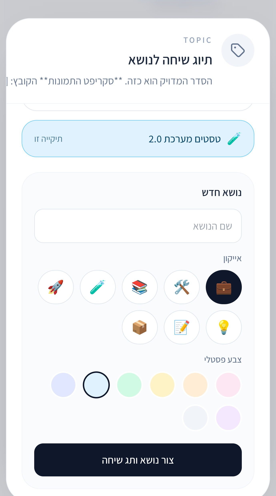
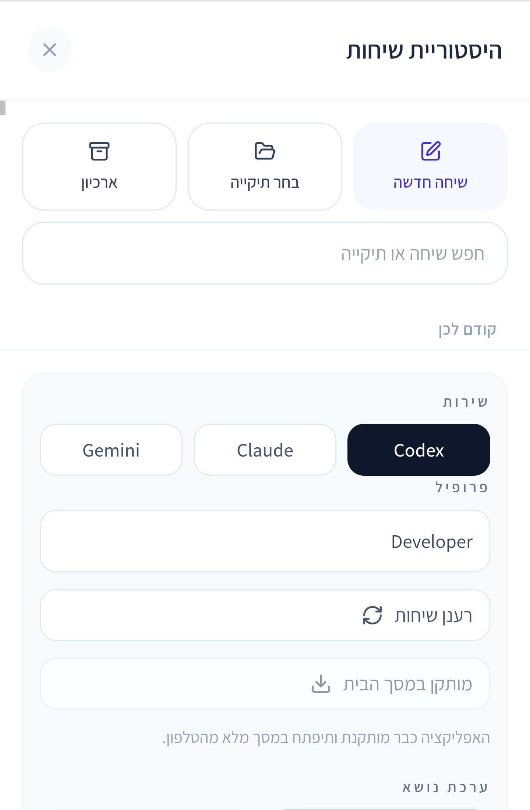
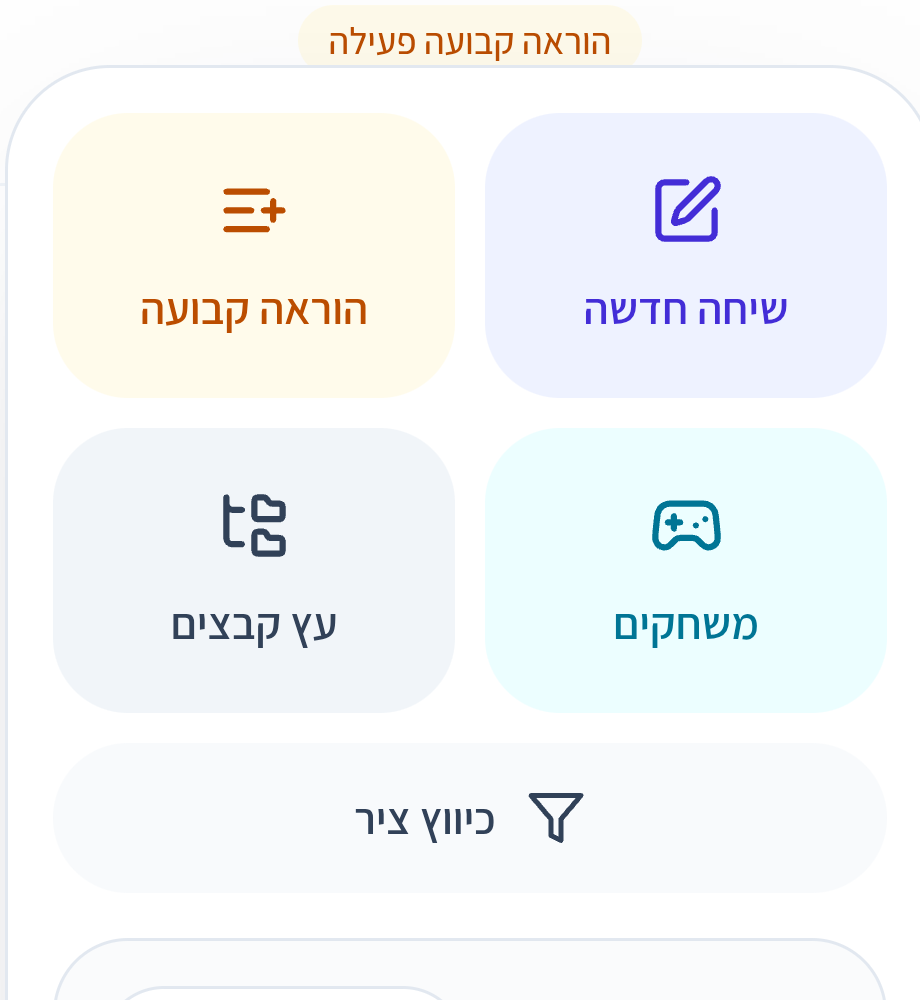
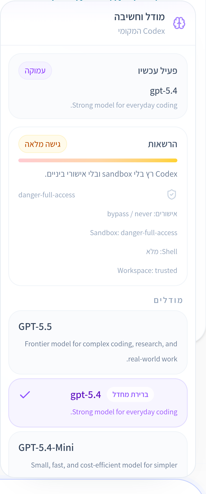

# code-ai

`code-ai` is a mobile-first workspace for running and coordinating the leading terminal coding agents from one interface:

- Codex
- Claude Code
- Gemini CLI

It is designed for operators who want one clean control plane for conversations, queueing, scheduling, topic grouping, project memory, cross-user transfer, support flows, and provider-specific execution settings without giving up local CLI power.

## Product Preview

<p align="center">
  
  
  
  
</p>

## What Makes It Different

- One UI for three providers, with real local profile homes per provider.
- Mobile-first session workflow instead of a desktop-only wrapper.
- Built-in queueing and scheduling, including deferred and recurring execution.
- Topic grouping, project boards, reminders, anchors, skills, and reusable context tools.
- Session-scoped Design Mode: Codex keeps control of code and behavior while a read-only Gemini specialist supplies implementation-ready visual direction, optionally informed by a full or cropped user canvas.
- Personal Chrome Mode: a paired Manifest V3 extension opens this workspace in Chrome's Side Panel and gives Codex audited tools for real tabs, DOM snapshots, element or region selection, forms, screenshots, console, network, and JavaScript.
- Cross-provider transfers and cross-user session copy flows.
- Internal support mode with isolated storage and sandbox rules.
- Trigger endpoints that can wake a normal session from an external system event.

## Core Experience

`code-ai` gives you a single workspace for:

- starting regular chats
- forking or transferring sessions
- attaching files, anchors, skills, reminders, and agent modes
- opening a drawing canvas and activating Design Mode only for the session that needs Codex × Gemini visual collaboration
- pairing a personal Chrome device and binding it to one session with explicit scopes and approval policy
- scheduling one-shot or recurring runs
- tracking session-local subtasks and project assignments
- inspecting changed files, tool traces, queue state, context usage, permissions, and rate limits

The app uses your real CLI installations and their real homes. It does not fake a provider layer on top of hosted APIs.

## Bring Your Own Providers

You can run the app with one provider or with all three.

Required base tooling:

- Node.js 20+
- npm
- Git

Optional provider CLIs:

- Codex CLI
- Claude CLI
- Gemini CLI

The full multi-provider experience is available when all three are installed and authenticated on the host.

## Quick Start

### Linux / macOS

```bash
git clone <repository-url>
cd code-ai
./install.sh \
  --app-name code-ai \
  --port 4000 \
  --profiles-json '[{"id":"codex-main","label":"Codex","provider":"codex","codexHome":"/home/ubuntu/.codex","workspaceCwd":"/srv/workspace","defaultProfile":true},{"id":"claude-main","label":"Claude","provider":"claude","codexHome":"/home/ubuntu/.claude","workspaceCwd":"/srv/workspace"},{"id":"gemini-main","label":"Gemini","provider":"gemini","codexHome":"/home/ubuntu/.gemini","workspaceCwd":"/srv/workspace"}]' \
  --device-password change-me-now \
  --session-secret change-me-too
```

### Windows PowerShell

```powershell
git clone <repository-url>
cd code-ai
powershell -ExecutionPolicy Bypass -File .\install.ps1 `
  --app-name code-ai `
  --port 4000 `
  --profiles-json '[{"id":"codex-main","label":"Codex","provider":"codex","codexHome":"C:\\Users\\Administrator\\.codex","workspaceCwd":"D:\\workspace","defaultProfile":true},{"id":"claude-main","label":"Claude","provider":"claude","codexHome":"C:\\Users\\Administrator\\.claude","workspaceCwd":"D:\\workspace"},{"id":"gemini-main","label":"Gemini","provider":"gemini","codexHome":"C:\\Users\\Administrator\\.gemini","workspaceCwd":"D:\\workspace"}]' `
  --device-password change-me-now `
  --session-secret change-me-too
```

## Repo Layout

- `client/` — the mobile UI
- `server/` — provider routing, queueing, parsing, and orchestration
- `chrome-extension/` — load-unpacked Manifest V3 Side Panel and real-browser bridge
- `skills/` — session-scoped specialist workflows, exposed only by the modes that activate them
- `deploy/code-ai/` — installer, export flow, and deployment assets
- `scripts/` — repo-local utilities
- `ecosystem.config.cjs` — PM2 process definition

## Important Runtime Concepts

### `workspaceCwd`

The default working directory used for new conversations.

### `codexHome`

Legacy field name for the provider home of the selected profile.

Examples:

- Codex -> `.codex`
- Claude -> `.claude`
- Gemini -> `.gemini`

The name stays `codexHome` for backward compatibility with existing installs and stored metadata, but it now means “provider home” across the whole app.

## Private inbound SSH for a personal computer

The personal-computer agent can carry an optional SSH bridge over the same
outbound connection as the remote API. This is useful when the computer is
behind NAT and must not expose OpenSSH to the public internet.

Add these owner-only values to the pairing file:

```dotenv
CODEX_REMOTE_SSH_REVERSE_PORT=44022
CODEX_REMOTE_SSH_LOCAL_PORT=22
```

The agent binds both reverse forwards to `127.0.0.1` on the control plane.
Install and start OpenSSH Server on the personal computer, authorize a
dedicated control-plane public key, and keep the public Windows firewall rule
disabled unless direct LAN access is intentionally required. From the control
plane, connect through `ssh -p 44022 <windows-user>@127.0.0.1`.

## Personal Chrome extension

The extension is deliberately separate from the isolated server-side browser.
It controls only a Chrome device that the operator explicitly pairs and binds
to the current session.

```bash
npm run extension:package -- \
  --output /tmp/code-ai-personal-chrome \
  --control-origin https://your-code-ai.example
```

Open `chrome://extensions`, enable **Developer mode**, choose **Load unpacked**,
and select the generated directory. In CODE-AI open **Modes → Personal Chrome**,
create a one-time code, pair the extension, choose the device, configure
read/write scopes and approval policy, then enable the mode for that session.

Bindings are session-specific and revocable. Risky actions require operator
approval according to policy, sensitive values are redacted from audit data,
and temporary port exposure is loopback-only with a TTL. See
`chrome-extension/README.md` for the permission and threat model.

## Where To Read Next

- `README.he.md` — Hebrew version
- `AGENT.md` — operator / handoff notes
- `WINDOWS.FIELD-NOTES.he.md` — practical Windows install notes
- `deploy/code-ai/install.mjs` — canonical installer
- `server/config.ts` — profile and storage configuration
- `client/src/components/codex/CodexMobileApp.tsx` — main UI shell

## Deployment Notes

The repo ships with a one-command installer that:

- writes `.env`
- writes `CODEX_PROFILES_JSON`
- creates app-managed storage
- installs dependencies
- builds client + server
- starts or refreshes PM2

If you are looking for operational details, use:

- `deploy/code-ai/install.mjs`
- `ecosystem.config.cjs`
- `AGENT.md`
